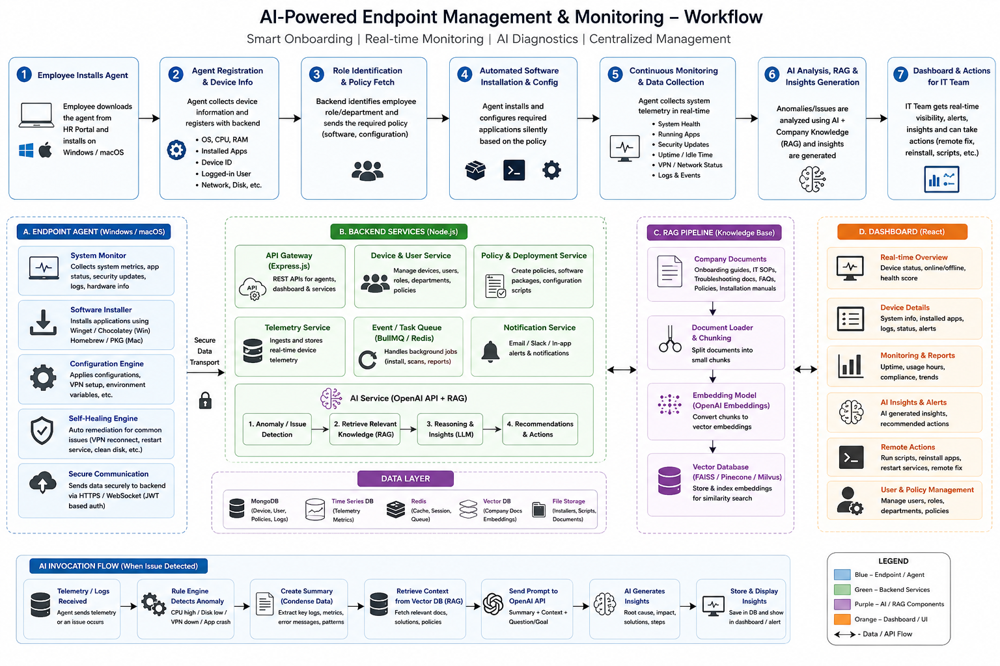

# AI-Powered Endpoint Management & Monitoring Platform (Interview Notes)

---

# 1. Project Introduction (2-minute answer)

## Problem

Our company works remotely, and every time a new employee joined, the IT team had to manually connect to the employee's laptop using remote access tools to:

- Install VPN
- Install development tools (Git, Node.js, Docker, VS Code)
- Install Office/Teams for non-technical employees
- Configure company settings
- Verify everything was working

This process took several hours and didn't scale as the company grew.

---

## Solution

We built an **AI-powered Endpoint Management Platform**.

Instead of IT manually configuring every laptop, employees simply downloaded an agent from the HR portal.

The agent automatically:

- Registered the device
- Identified the employee's role
- Installed required software
- Applied configurations
- Continuously monitored device health
- Reported everything to a centralized dashboard

AI was **not used for software installation**.

AI was used for:

- Intelligent diagnostics
- Root cause analysis
- Natural language IT assistant
- Company-specific troubleshooting using RAG

Result:

**Reduced onboarding time by approximately 50%.**

---

# 2. Complete Architecture

```
Employee

↓

Downloads Agent

↓

Registers Device

↓

Policy Engine

↓

Install Required Apps

↓

Continuous Monitoring

↓

Store Telemetry

↓

Rule Engine

↓

Issue?

↓

No
Store data

↓

Yes

↓

Summarize Logs

↓

Retrieve Company Docs (RAG)

↓

OpenAI

↓

Diagnosis

↓

Dashboard

↓

IT Team Takes Action
```

---

# 3. Technology Stack

## Agent

- Node.js
- TypeScript
- Windows Service
- macOS Launch Agent
- systeminformation
- child_process
- PowerShell
- Winget
- Homebrew

---

## Backend

- Node.js
- Express.js
- MongoDB
- Redis
- BullMQ
- REST APIs
- JWT
- WebSockets

---

## Frontend

- React
- TypeScript

---

## AI

- OpenAI API
- RAG
- Vector Database (Pinecone/FAISS/Milvus)

---

# 4. Agent Workflow

## Step 1

Employee downloads

```
company-agent.exe
```

or

```
company-agent.pkg
```

---

## Step 2

Agent registers device

Collects

- CPU
- RAM
- Disk
- OS
- Installed Apps
- Device ID
- Logged-in User

Calls

```
POST /register-device
```

Backend stores

```
Employee

Department

Device

Status
```

---

## Step 3

Backend identifies employee role.

Example

```
Engineering
```

Policy Engine decides

Install

```
Git

VS Code

Node.js

Docker

VPN
```

Manager

```
Office

Teams

VPN
```

---

## Step 4

Agent installs software

Windows

```
Winget

PowerShell
```

macOS

```
Homebrew
```

---

## Step 5

Agent continuously monitors

- CPU
- Memory
- Disk
- Battery
- VPN
- Installed Apps
- Running Services
- Windows Updates
- Error Logs

Every minute

↓

Backend

↓

MongoDB

---

# 5. What is Policy Engine?

Policy Engine answers

> **What should this employee receive?**

Example

```
Engineering

↓

Git

Docker

Node

VSCode
```

HR

↓

```
Office

Teams

VPN
```

Simple business rules.

No AI.

---

# 6. What is Rule Engine?

Rule Engine answers

> **Is something wrong?**

Example

```
CPU >90%

Disk <10%

VPN Down

Windows Update Failed

Installation Failed
```

If true

↓

Create Alert

Still

No AI.

---

# 7. Where AI Starts

Suppose Rule Engine detects

```
CPU 95%

Memory 90%

VPN Down

Docker Crash
```

Backend summarizes

```
CPU above 90%

VPN disconnected

Docker repeatedly crashed

Disk only 8GB free
```

Instead of

```
10,000 telemetry logs
```

AI receives

```
300-token summary
```

---

# 8. RAG Flow

Company documents

- VPN Guide
- Installation Manual
- Troubleshooting SOP
- Security Policies

↓

Chunk

↓

Embeddings

↓

Vector DB

↓

Similarity Search

↓

Relevant Documents

↓

OpenAI

---

# 9. AI Prompt

Prompt

```
Device Summary

+

Relevant Company Docs

+

Question
```

Example

```
CPU high

VPN disconnected

Docker crashing

Based on company guide,
find root cause.
```

AI

↓

```
Restart Docker

Renew VPN Certificate

Run Cleanup Script
```

---

# 10. Dashboard

IT Team sees

- Device Health
- Online/Offline
- CPU
- RAM
- Disk
- VPN
- Installed Apps
- Alerts
- AI Diagnosis
- Recommended Fixes

---

# 11. Why Not Send Everything To OpenAI?

Bad Idea

```
Every minute

↓

CPU

RAM

Disk

Logs

Apps

Errors

↓

OpenAI
```

Problems

- Expensive
- Slow
- Context Window Limit
- Privacy

Instead

```
Store Raw Data

↓

Rule Engine

↓

Issue Detected

↓

Summarize

↓

OpenAI
```

---

# 12. Why RAG?

Without RAG

AI gives

```
Generic Answer
```

With RAG

AI answers using

- Company VPN Guide
- Internal SOPs
- Company Policies
- Installation Manuals

Better accuracy.

---

# 13. ATS Resume Bullet

- Developed an AI-powered endpoint management platform using **Node.js**, **TypeScript**, **React**, **MongoDB**, and **OpenAI APIs** to automate remote employee onboarding, role-based software provisioning, and Windows/macOS device management, reducing onboarding effort by **50%**.
- Built a centralized monitoring dashboard with AI-driven diagnostics, RAG-based troubleshooting, and real-time device telemetry for proactive IT operations and endpoint compliance.

---

# Interview Questions

---

## Q1. Explain your project.

> We built an AI-powered endpoint management platform that automated remote employee onboarding. Employees downloaded an agent from our HR portal, which registered the device, installed role-based software, monitored device health, and reported telemetry to a centralized dashboard. AI was used for diagnostics, troubleshooting, and natural-language IT assistance, while installation and monitoring were handled through deterministic automation.

---

## Q2. Why Node.js?

> Node.js is cross-platform, allowing us to support Windows and macOS with a shared codebase. It also provides modules like `child_process` to execute PowerShell, Winget, and Homebrew commands, along with libraries such as `systeminformation` to collect device metrics.

---

## Q3. Why didn't you use AI for software installation?

> Software installation follows company policies, so deterministic business rules are more reliable and auditable. AI was used only where reasoning was required, such as diagnostics, summarization, and troubleshooting.

---

## Q4. What is Policy Engine?

> The Policy Engine decides what software and configurations a user should receive based on their department and role.

---

## Q5. What is Rule Engine?

> The Rule Engine monitors telemetry and detects anomalies such as high CPU, low disk space, VPN failures, or installation errors using predefined thresholds.

---

## Q6. Where exactly did you use OpenAI?

> OpenAI was used for intelligent diagnostics, root cause analysis, natural-language IT queries, and summarizing device issues. It was never used for continuous monitoring or software installation.

---

## Q7. How did you implement RAG?

> We indexed company documentation, including VPN guides, installation manuals, troubleshooting SOPs, and security policies into a vector database. When AI analysis was required, we retrieved only the most relevant document chunks and included them in the prompt.

---

## Q8. Why RAG?

> RAG allowed the model to answer using company-specific documentation rather than generic knowledge, improving accuracy and reducing hallucinations.

---

## Q9. Do you send all telemetry to OpenAI?

> No. Raw telemetry is stored in MongoDB. A Rule Engine detects anomalies, summarizes only relevant information, retrieves supporting documents via RAG, and then invokes the LLM. This reduces token usage, latency, and cost.

---

## Q10. How did you manage the context window?

> We never sent raw logs. We summarized telemetry into concise incident reports and included only the top relevant documents retrieved through RAG, keeping prompts small and focused.

---

## Q11. What if OpenAI is unavailable?

> The platform continues to operate because onboarding, software installation, monitoring, and policy enforcement are deterministic. AI enhances diagnostics but is not required for core functionality.

---

## Q12. Biggest Technical Challenge?

> Balancing continuous device monitoring with AI cost and latency. We solved this by separating telemetry collection from AI analysis, introducing a Rule Engine for anomaly detection, and using RAG with summarized context instead of sending raw telemetry.

---

# Final 30-Second Summary

> "Our project automated remote employee onboarding by building a cross-platform endpoint management agent for Windows and macOS. The agent registered devices, installed role-based software, and continuously collected telemetry. A Policy Engine determined what software to install, while a Rule Engine detected operational issues. Only when anomalies occurred did we invoke OpenAI with summarized telemetry and relevant company documentation retrieved through a RAG pipeline. This provided intelligent diagnostics and troubleshooting while keeping AI usage efficient, scalable, and cost-effective, ultimately reducing onboarding effort by around 50%."


