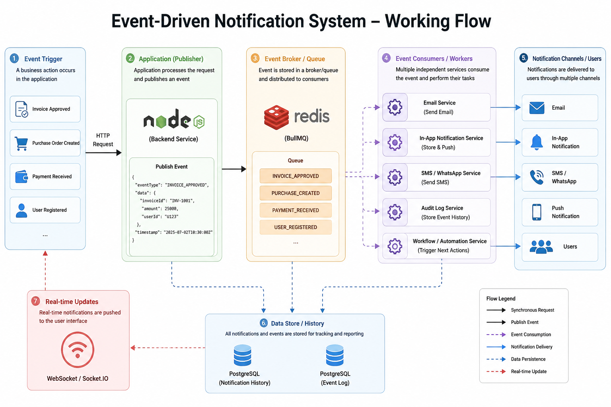

## Developed Event-Driven Notification System using TypeScript • Node.js • Express.js • React • PostgreSQL • Redis • REST APIs • Socket.IO • Git

A good interview answer should explain the **business value first**, not the technology.

> **SyntraOne is an enterprise business management platform that helps companies manage their day-to-day operations from a single system.** It combines modules like finance, sales, procurement, inventory, HR, and project management, so businesses don't have to use multiple disconnected applications.
>
> One of its key strengths is **e-invoicing and business process automation**. It helps organizations generate, validate, and manage invoices while integrating with existing ERP systems and complying with government tax regulations.
>
> In simple terms, **SyntraOne acts as a central platform where businesses can manage their operations, automate repetitive processes, and improve efficiency.**

### If the interviewer asks, "Can you give me a real-world example?"

You could say:

> Imagine a manufacturing company receives a purchase order. Using SyntraOne, they can:
>
> - Create the sales order.
> - Manage inventory.
> - Generate the invoice.
> - Send the e-invoice to the tax authority if required.
> - Track payment.
> - Update accounting records.
>
> All of these steps happen within one integrated platform instead of using multiple separate systems.

This explanation is concise, business-focused, and demonstrates that you understand what the product does beyond just its technology stack.

For a **Full Stack JavaScript** interview, don't start by saying _"We used Kafka"_ or _"We used Redis."_ Start with **the business problem**, then explain the architecture, then your contribution.

---

## Interviewer: What is the Event-Driven Notification System?

> The Event-Driven Notification System is responsible for notifying users whenever an important business event occurs in the ERP.
>
> For example, if an invoice is approved, a purchase order is created, or a payment fails, the system automatically sends notifications to the appropriate users instead of requiring someone to check the ERP manually.

---



## Give a real example

> Suppose a manager approves an invoice.
>
> As soon as the approval is completed, our application publishes an event. Different services listen for that event and perform their respective tasks.
>
> For example:
>
> - Send an email to the finance team.
> - Show an in-app notification.
> - Update the notification history.
> - Trigger another workflow if required.
>
> This allows each service to work independently without tightly coupling everything together.

---

## Draw this during the interview

```text
Manager Approves Invoice
           │
           ▼
      Node.js API
           │
   Publish Event
           │
     Redis/BullMQ Queue
           │
 ┌─────────┼─────────┐
 ▼         ▼         ▼
Email   In-App    Audit Log
Service Notification Service
```

_(If your team used Kafka or RabbitMQ instead of BullMQ, replace the queue accordingly.)_

---

# What tech stack did you use?

If you stayed within the JavaScript ecosystem, a typical stack is:

### Backend

- TypeScript
- Node.js
- Express.js

### Queue / Event Processing

- **BullMQ + Redis** _(very common in Node.js projects)_
- or RabbitMQ
- or Kafka (if your company used it)

### Database

- PostgreSQL

### Frontend

- React

### Notification Channels

- SMTP/Nodemailer (Email)
- Firebase Cloud Messaging (Mobile Push)
- Socket.IO (Real-time notifications)
- WebSockets

---

## What was your contribution?

> I contributed to the notification service by implementing backend APIs, publishing events after business operations, and developing consumers that processed those events asynchronously.
>
> I also implemented notification templates, stored notification history in PostgreSQL, and exposed APIs for the React frontend to display user notifications.

---

## What was the impact?

> Before this implementation, users had to manually check different ERP modules to know if an action was completed.
>
> With the event-driven approach, notifications were delivered automatically whenever a business event occurred. This reduced manual follow-ups, improved response time, and kept users informed in real time while keeping the application scalable through asynchronous processing.

---

# If the interviewer asks, "Why did you use an event-driven architecture?"

A strong answer is:

> Not every task needs to happen during the user's request. Sending emails, push notifications, and writing audit logs can take time.
>
> By publishing an event, the main business transaction completes quickly, while background workers process notifications independently. This improves application responsiveness, scalability, and makes it easier to add new notification channels in the future without changing the core business logic.

---

### Resume-friendly tech stack

**TypeScript | Node.js | Express.js | React | PostgreSQL | Redis (BullMQ) | REST APIs | Socket.IO | Git**

This explanation shows both your understanding of the business value and the technical design, which is what interviewers typically look for.
